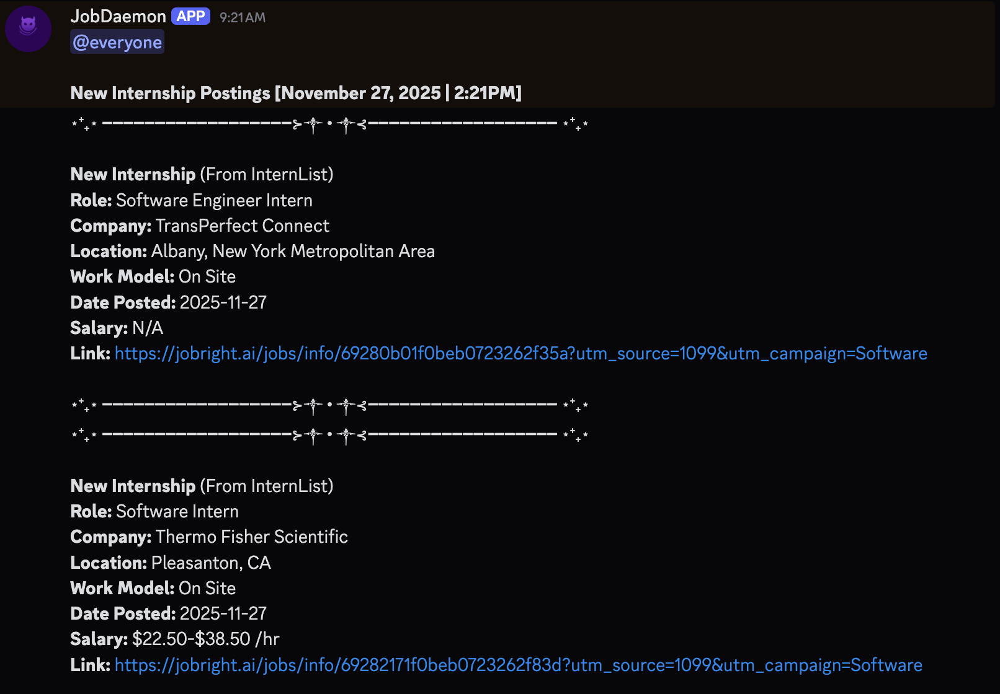
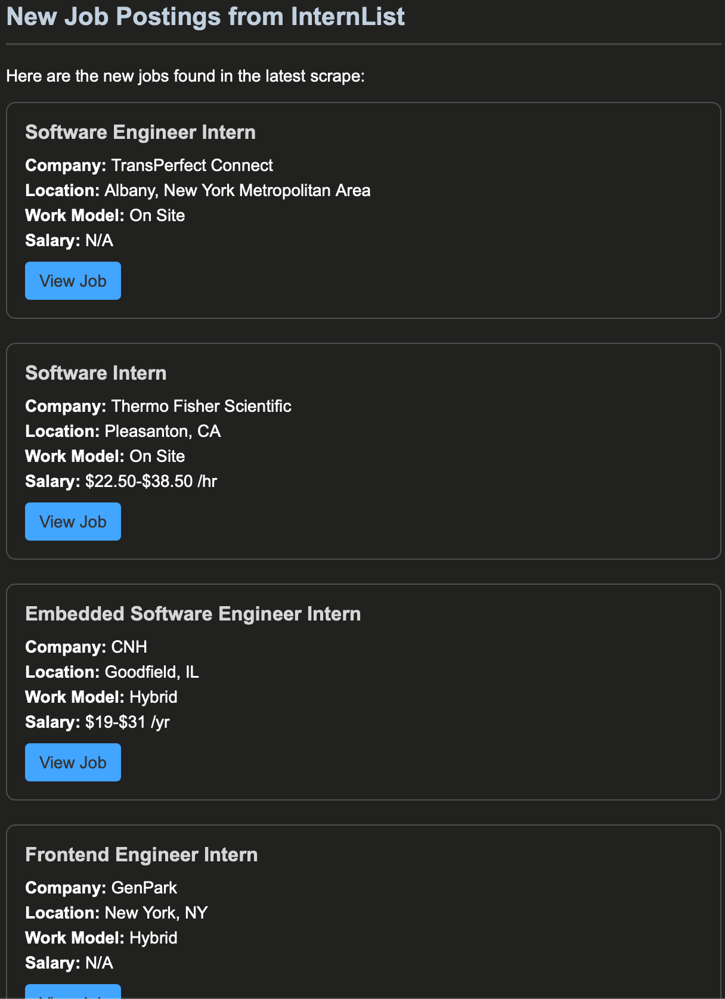

# JobDaemon

A robust background service to scrape and notify about new Software Engineering internships.

## Features

- **Reliable Scraping:** Downloads and parses the CSV export from `intern-list.com` to ensure all jobs are captured.
- **Smart Filtering:** 
  - Detects new postings and avoids duplicates using SQLite.
  - Filters jobs to only include those posted "today".
- **Rich Notifications:** 
  - Sends formatted Discord notifications with clean links and metadata.
  - Sends email summaries of new batches.
- **Automated Scheduling:** Runs automatically every 10 minutes.
- **Production Ready:** Includes a keep-alive HTTP server for Render deployment.

## Screenshots

### Discord Notifications


### Email Summary


## Installation

1.  **Clone the repository:**
    ```bash
    git clone git@github.com:justincordova/JobDaemon.git
    cd JobDaemon
    ```

2.  **Install dependencies:**
    ```bash
    npm install
    ```

3.  **Configure Environment:**
    Create a `.env` file in the root directory:
    ```env
    # Discord Configuration
    DISCORD_WEBHOOK_URL=https://discord.com/api/webhooks/...

    # Email Configuration (Resend)
    RESEND_API_KEY=re_123456789
    EMAIL_TO=recipient@email.com
    # Optional: Custom sender domain (default: onboarding@resend.dev)
    # EMAIL_FROM=noreply@yourdomain.com

    # Render / Production (Optional locally)
    # PUPPETEER_CACHE_DIR=/opt/render/project/src/.cache/puppeteer
    ```

## Usage

### Development Mode
Run the service locally with hot-reloading (if configured) or direct execution:
```bash
npm run dev
```

### Testing
Run specific test scripts to verify functionality:
- **Test Notification:** `npx tsx src/test/test-notification.ts`
- **Test Email:** `npx tsx src/test/test-email.ts`
- **Test Ping:** `npx tsx src/test/test-ping.ts`
- **Test CSV Download:** `npx tsx src/test/test-download.ts`

### Production Build
1.  **Build the project:**
    ```bash
    npm run build
    ```

2.  **Start the daemon:**
    ```bash
    npm start
    ```

## Deployment (Render)

1.  **Build Command:** `npm install && npm run build`
2.  **Start Command:** `npm start`
3.  **Environment Variables:**
    - Set `PUPPETEER_CACHE_DIR` to `/opt/render/project/src/.cache/puppeteer` to persist the browser binary.
    - Set `PUPPETEER_SKIP_CHROMIUM_DOWNLOAD` to `true` if using a custom buildpack

## Project Structure

- `src/scraper.ts`: Logic for downloading and parsing the InternList CSV.
- `src/notifier.ts`: Handles Discord webhook notifications and pings.
- `src/email_notifier.ts`: Handles sending email summaries via Nodemailer.
- `src/database.ts`: SQLite database operations with duplicate prevention.
- `src/scheduler.ts`: Cron job configuration and orchestration.
- `src/index.ts`: Entry point and HTTP server.
- `src/test/`: Test scripts for individual components.
